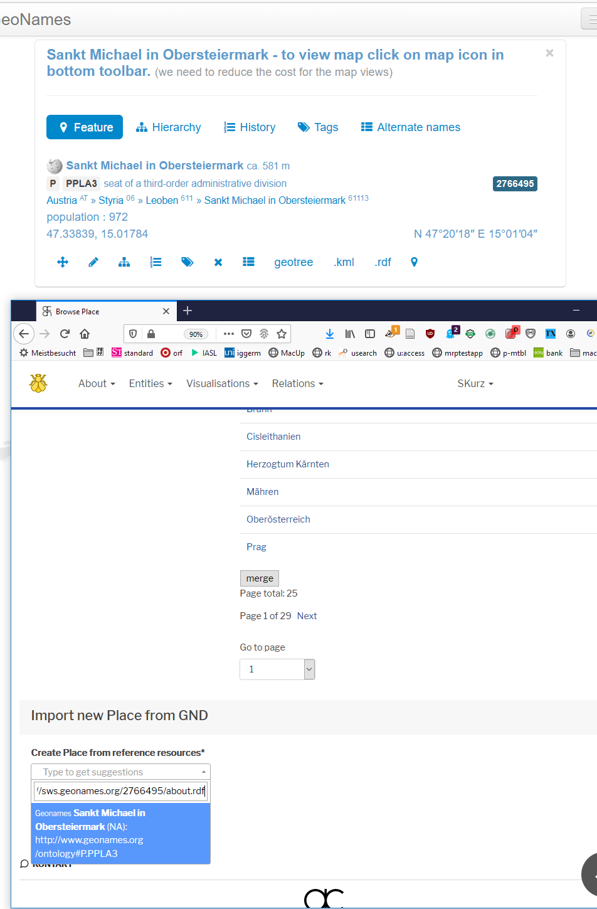

Wenn ein Ort angelegt werden muss weil in APIS nicht vorhanden:

- Suche im "import new Place from GND"-Bereich ganz unten links
- wenn zu viele bei "St. Michael" o.ä.:
  - Suche direkt auf geonames.org
  - .rdf Link (letzte Zeile im geonames Kasterl, zweites von rechts) kopieren
  - und pasten in das Dropdown; das wird gelesen und importiert

(Das ist ein Workaround, bis das Word-Plugin den Ort selber auch aus den Normdaten heraus mitanlegt)
